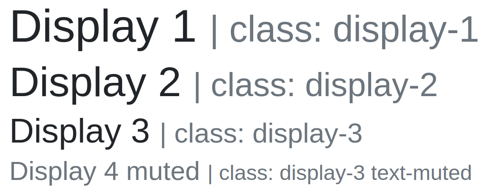
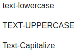
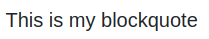
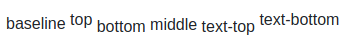

# Typography
## h1, h2, h3, h4 as a class
~~~html
<h1>Heading one</h1>
<h4 class="h1">Heading one</h4> <!-- Adding the h1 class to h4 makes it look like h1 -->
~~~
## Muted text

Adding muted text (looks grey):
~~~html
<h1>Hello World
  <small class="text-muted"></small>
<h1>
~~~
## Display property

Display text:
~~~html
<h1 class="display-1">Display 1</h1>
<h2 class="display-2">Display 2 </h2>
<h3 class="display-3">Display 3</h3>

<!-- or h1 with display-3 -->
<h1 class="display-3">Display 3</h1>
~~~
## Font weight
Font weight:
~~~html

font-weight-light

font-weight-normal

font-weight-bold

~~~

## Lowercase, uppercase, capitalize (text transforms)

~~~html

Test
        => test

test
        => TEST

test
       => Test
~~~

## Blockquotes

~~~html
<blockquote class="blockquote">
  This is my blockquote
</blockquote>
~~~

### Blockquote with footer

~~~html
<blockquote class="blockquote">
  Hello World
  <footer class="blockquote-footer">
    Some author
  </footer>
</blockquote>
~~~

### Right aligned blockquote with footer

~~~html
<blockquote class="blockquote text-right">
  This is my right-aligned blockquote with an author (footer)
  <footer class="blockquote-footer"> Some author </footer>
</blockquote>
~~~

## Lists
~~~html
<!-- remove bullet points -->
<ul class="list-unstyled">
  <li>List item</li>
  <li>List item</li>
</ul>

<!-- inline list -->
<ul class="list-inline">
  <li class="list-inline-item">Item</li>
  <li class="list-inline-item">Item</li>
  <li class="list-inline-item">Item</li>
</ul>
~~~

# Text-alignment & Display
## Justify
~~~html
  

    Adipisicing molestias ipsa excepturi pariatur possimus. Non distinctio in aspernatur?
  

~~~

## Align
~~~html
  

    Text
  

  

    Text
  

  

    Aligned right on small or larger
  

  

    Aligned right on medium or larger
  

  

    Aligned right on large or larger
  

  

    Aligned right on xl or larger
  

  

    Aligned center on small
  

~~~

### Vertical alignment:

~~~html
baseline
top
bottom
middle
text-top
text-bottom
~~~

### Display as inline
Turns block to inline-block:
~~~html
<h1 class="d-inline">Hello World</h1>
~~~

Display background on element:
~~~html
<h1 class="d-inline bg-success">Hello World</h1>
~~~

### Display as block:
~~~html

  Hello World

~~~

### Display as inline-block
~~~html

  Hello World

~~~

# Floats & Fixed positions
~~~html

~~~

Responsive:
~~~html

~~~

## Clearfix
~~~html

  

  

~~~

## Fixed & Sticky
Fixed to the top:
~~~html

~~~

Fixed to the bottom:
~~~html

~~~

Normal flow, when goes out of viewport sticks to the top (becomes fixed):
~~~html

~~~

# Colors & Background
## Colors:

~~~html

text-primary

text-secondary

text-success

text-info

text-warning

text-danger

text-light

text-dark

text-white

~~~

## Background
~~~html

Test

Test

Test

Test

Test

Test

Test

Test

Test

~~~

# Margins & Padding
## General
Margins are prefixed by `m`. You can specify `m-1`, `mx-1`, `my-1`, `mt-1`, `mb-1`

Margin of top, right, bottom, left are specified by the general `m` property.
You can specify numbers from 1 to 5. Example
~~~html
  <h1 class="bg-success m">Hello World</h1>
~~~
