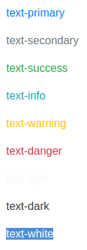
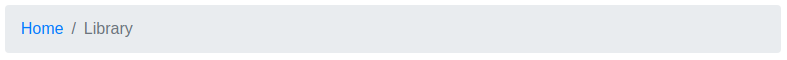

# Typography
## h1, h2, h3, h4 as a class
~~~html
<h1>Heading one</h1>
<h4 class="h1">Heading one</h4> <!-- Adding the h1 class to h4 makes it look like h1 -->
~~~
## Muted text

Adding muted text (looks grey):
~~~html
<h1>Hello World
  <small class="text-muted"></small>
<h1>
~~~
## Display property

Display text:
~~~html
<h1 class="display-1">Display 1</h1>
<h2 class="display-2">Display 2 </h2>
<h3 class="display-3">Display 3</h3>

<!-- or h1 with display-3 -->
<h1 class="display-3">Display 3</h1>
~~~
## Font weight
Font weight:
~~~html

font-weight-light

font-weight-normal

font-weight-bold

~~~

## Lowercase, uppercase, capitalize (text transforms)

~~~html

Test
        => test

test
        => TEST

test
       => Test
~~~

## Blockquotes

~~~html
<blockquote class="blockquote">
  This is my blockquote
</blockquote>
~~~

### Blockquote with footer

~~~html
<blockquote class="blockquote">
  Hello World
  <footer class="blockquote-footer">
    Some author
  </footer>
</blockquote>
~~~

### Right aligned blockquote with footer

~~~html
<blockquote class="blockquote text-right">
  This is my right-aligned blockquote with an author (footer)
  <footer class="blockquote-footer"> Some author </footer>
</blockquote>
~~~

## Lists
~~~html
<!-- remove bullet points -->
<ul class="list-unstyled">
  <li>List item</li>
  <li>List item</li>
</ul>

<!-- inline list -->
<ul class="list-inline">
  <li class="list-inline-item">Item</li>
  <li class="list-inline-item">Item</li>
  <li class="list-inline-item">Item</li>
</ul>
~~~

# Text-alignment & Display
## Justify
~~~html
  

    Adipisicing molestias ipsa excepturi pariatur possimus. Non distinctio in aspernatur?
  

~~~

## Align
~~~html
  

    Text
  

  

    Text
  

  

    Aligned right on small or larger
  

  

    Aligned right on medium or larger
  

  

    Aligned right on large or larger
  

  

    Aligned right on xl or larger
  

  

    Aligned center on small
  

~~~

### Vertical alignment:

~~~html
baseline
top
bottom
middle
text-top
text-bottom
~~~

### Display as inline
Turns block to inline-block:
~~~html
<h1 class="d-inline">Hello World</h1>
~~~

Display background on element:
~~~html
<h1 class="d-inline bg-success">Hello World</h1>
~~~

### Display as block:
~~~html

  Hello World

~~~

### Display as inline-block
~~~html

  Hello World

~~~

# Floats & Fixed positions
~~~html

~~~

Responsive:
~~~html

~~~

## Clearfix
~~~html

  

  

~~~

## Fixed & Sticky
Fixed to the top:
~~~html

~~~

Fixed to the bottom:
~~~html

~~~

Normal flow, when goes out of viewport sticks to the top (becomes fixed):
~~~html

~~~

# Colors & Background
## Colors:

~~~html

text-primary

text-secondary

text-success

text-info

text-warning

text-danger

text-light

text-dark

text-white

~~~

## Background
~~~html

Test

Test

Test

Test

Test

Test

Test

Test

Test

~~~

# Margins & Padding
## General
Margins are prefixed by `m`. You can specify `m-1`, `mx-1`, `my-1`, `mt-1`, `mb-1`

Margin of top, right, bottom, left are specified by the general `m` property.
You can specify numbers from 1 to 5. Examples:

~~~html
  <!-- ---------------- MARGIN ---------------- -->
  <!-- general margin (x and y axis) -->
  <h1 class="m-1">m-1</h1>
  <h1 class="m-2">m-2</h1>
  <h1 class="m-3">m-3</h1>
  <h1 class="m-4">m-4</h1>
  <h1 class="m-5">m-5</h1>

  <!-- margin on x axis -->
  <h1 class="mx-1"></h1>
  <h1 class="mx-2"></h1>
  <h1 class="mx-3"></h1>
  <h1 class="mx-4"></h1>
  <h1 class="mx-5"></h1>

  <!-- margin on y axis -->
  <h1 class="my-1"></h1>
  <h1 class="my-2"></h1>
  <h1 class="my-3"></h1>
  <h1 class="my-4"></h1>
  <h1 class="my-5"></h1>

  <!-- margin left -->
  <h1 class="ml-1"></h1>
  <h1 class="ml-2"></h1>
  <h1 class="ml-3"></h1>
  <h1 class="ml-4"></h1>
  <h1 class="ml-5"></h1>

  <!-- margin right -->
  <h1 class="mr-1"></h1>
  <h1 class="mr-2"></h1>
  <h1 class="mr-3"></h1>
  <h1 class="mr-4"></h1>
  <h1 class="mr-5"></h1>

  <!-- ---------------- PADDING ---------------- -->

  <!-- general padding (x and y axis) -->
  <h1 class="p-1"></h1>
  <h1 class="p-2"></h1>
  <h1 class="p-3"></h1>
  <h1 class="p-4"></h1>
  <h1 class="p-5"></h1>

  <!-- padding on x axis -->
  <h1 class="px-1"></h1>
  <h1 class="px-2"></h1>
  <h1 class="px-3"></h1>
  <h1 class="px-4"></h1>
  <h1 class="px-5"></h1>

  <!-- padding on y axis -->
  <h1 class="py-1"></h1>
  <h1 class="py-2"></h1>
  <h1 class="py-3"></h1>
  <h1 class="py-4"></h1>
  <h1 class="py-5"></h1>

  <!-- padding left -->
  <h1 class="pl-1"></h1>
  <h1 class="pl-2"></h1>
  <h1 class="pl-3"></h1>
  <h1 class="pl-4"></h1>
  <h1 class="pl-5"></h1>

  <!-- padding right -->
  <h1 class="pr-1"></h1>
  <h1 class="pr-2"></h1>
  <h1 class="pr-3"></h1>
  <h1 class="pr-4"></h1>
  <h1 class="pr-5"></h1>
~~~

# Sizing & Borders
## Width:

~~~html

This element takes 25%

This element takes 50%

This element takes 75%

~~~

## Height:

~~~html

  
 <!-- takes 25% width and 25% height of parent -->
  

~~~

You cannot specify other values in the class.

## Borders
~~~html

<!-- You can also add rounded corners through the "rounded" class: -->

<!-- To remove a bottom border: -->

~~~

# Buttons
~~~html
<button class="btn btn-primary"></button>
<button class="btn btn-info"></button>
<button class="btn btn-success"></button>
<button class="btn btn-alert"></button>
<button class="btn btn-warning"></button>
<button class="btn btn-danger"></button>
~~~

## Outline buttons
~~~html
<button class="btn btn-outline-primary"></button>
<button class="btn btn-outline-info"></button>
<button class="btn btn-outline-success"></button>
<button class="btn btn-outline-alert"></button>
<button class="btn btn-outline-warning"></button>
<button class="btn btn-outline-danger"></button>
~~~

## Button styles
~~~html
<!-- large button -->
<button class="btn btn-primary btn-lg"></button>
<!-- disabled button -->
<button class="btn btn-primary disabled"></button>
<!-- active button -->
<button class="btn btn-primary active"></button>
~~~

## Dropdown button
~~~html

  <button type="button" class="btn btn-primary dropdown-toggle" data-toggle="dropdown">
    Hello World
  </button>
  

    <a class="dropdown-item" href="#">Test</a>
    <a class="dropdown-item" href="#">Test</a>
    <a class="dropdown-item" href="#">Test</a>
  

~~~

## Button groups
~~~html

  <button class="btn"></button>
  <button class="btn"></button>

~~~

# Navbar & Nav
## Navbar
~~~haml
nav.navbar.navbar-expand-sm.navbar-light.bg-light
  .container
    .navbar-brand
      ul.navbar-nav
        li.nav-item
          a.nav-link Test
        li.nav-item
          a.nav-link Test
~~~

[Official Documentation](https://getbootstrap.com/docs/4.0/components/navbar/)

## Nav
[Official Documentation](https://getbootstrap.com/docs/4.0/components/navs/)

# List groups & Badges
## Lists groups:
~~~haml
ul.list-group
  li.list-group-item Text

-#
  To make it light up when you hover:
ul.list-group
  li.list-group-item.list-group-item-action Text
~~~

You can use contextual classes with list groups:
~~~haml
ul.list-group
  li.list-group-item.list-group-item-primary
  li.list-group-item.list-group-item-success
  li.list-group-item.list-group-item-warning
~~~

## Badges

[Official Documentation](https://getbootstrap.com/docs/4.0/components/list-group/)

## Breadcrumbs

~~~haml
ol.breadcrumb
	li.breadcrumb-item
		a{ :href => Home } Home
	li.breadcrumb-item.active
		a{ :href => Home } Library
	li.breadcrumb-item
		a{ :href => Home } Data
~~~

# Forms
~~~haml
.form-group
	%label{ for: "name" } Name
		%input.form-control{ id: "name", type: "text" }
-#
	You can make the form control large or small

.form-control.form-control-sm
.form-control.form-control-lg
~~~

Form row:
~~~haml
.form-row
	.col
		input.form-control{ placeholder: "First name" }
	.col
		input.form-control{ placeholder: "Last name"
~~~

Form validation:
~~~haml

-#
	Add the .is-valid class to give a green border

.form-group
  label{ for: "test" } Test
	input.form_control.is-valid{ id: "test" }

-#
	Invalid is .is-invalid

.form-group
  label{ for: "test" } Test
	input.form_control.is-invalid{ id: "test" }
~~~

# Input groups

~~~html

  

    $
  

  <input type="text" class="form-control">
  

    .00
  

~~~

# Alerts
Alerts also have contextual classes.

~~~html

  Primary

  Secondary

  Success

<!-- etc. -->
~~~

Alerts can be dismissable:

~~~html

  <button type="button" class="close" data-dismiss="alert">
    &times;
  </button>
  <strong>Dismissable</strong> Blog post added

~~~
